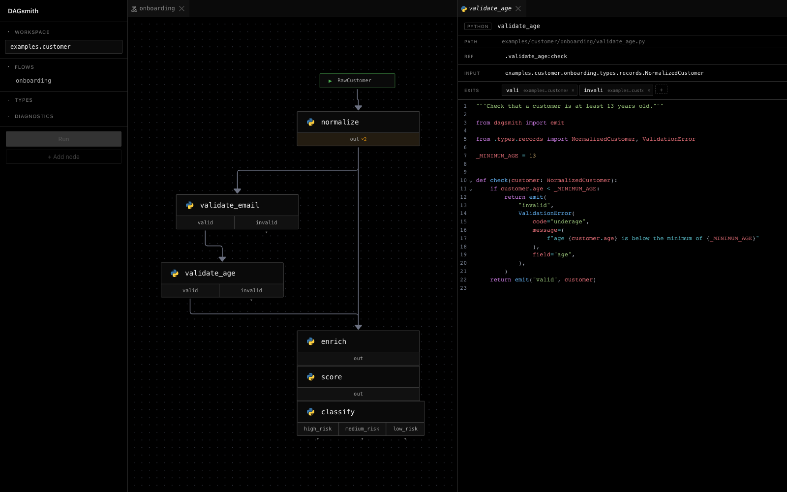
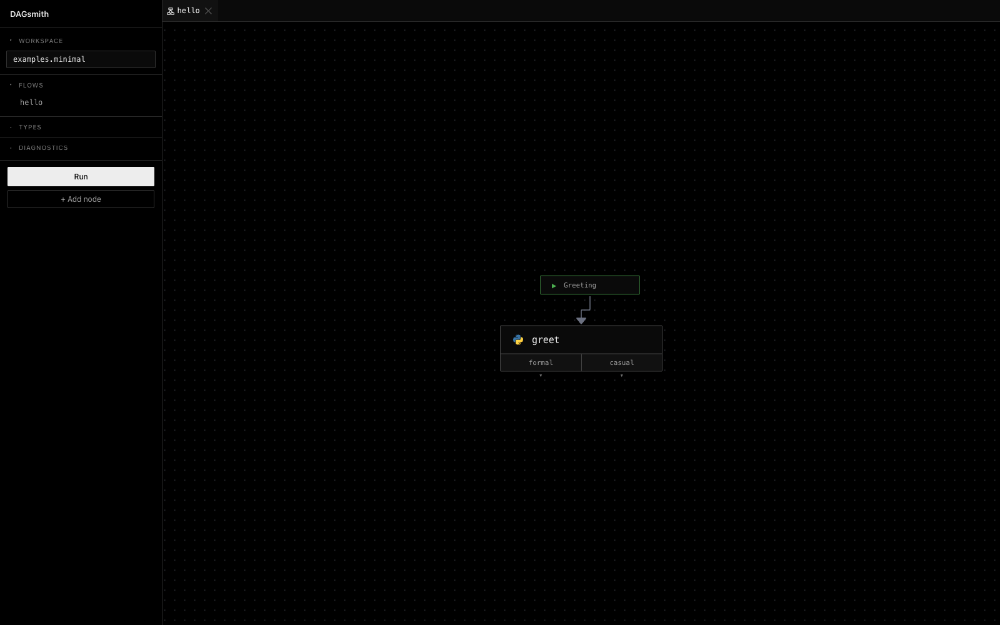

# DAGsmith

Visual flowchart authoring for Python.

- **Edits the graph, writes the code.** Nodes are real `.py` files in your package; authoring happens in the browser and lands as clean Python you can read and import. No compile step, no separate runtime.
- **Typed end-to-end.** Every node declares its input and named exits, so a flow is a well-defined branching function — not free-form glue.
- **Built with LLM authoring in mind.** A flow is one small `flow.json` plus a handful of node modules — a much easier surface for a model to write coherent decision trees against than nested `if`/`match` chains. Long-term goal: make this the natural shape LLMs reach for when the task is "decide what to do next."



## A few more details

- **Permissive backend, runtime-checked.** The backend accepts any shape and emits diagnostics; the runtime raises at the point of violation. You can edit a half-broken graph in the UI without it refusing to load.
- **Public exits are inferred.** Any unconnected source handle becomes a named exit of the whole flow. No explicit terminal nodes.
- **Local-first.** A workspace is just a Python package containing `flow.json` files and node modules. No database, no cloud, no account.

## Stage

Early. The core model, runtime, server API, and editor are working — the
two example workspaces (`examples.minimal` and `examples.customer`) run
end-to-end from Python and from the UI. 123 backend tests pass.

The visual layer is under heavy iteration: per-node source preview tabs,
the merged metadata-plus-editor panel, snap-stacked nodes, and the
inferred-exit chevron all landed recently. Forward work tracked in
`docs/CHANGES_2026-04.md` and the `docs/EDITOR_MERGE.md` /
`docs/NODE_TAXONOMY.md` design docs. Expect things to move; the API
surface is not stable.

## Inspiration & motivation

The shape of the editor owes a real debt to
[**Windmill**](https://www.windmill.dev) — their flow editor is the
clearest "DAG of typed functions" UX in the wild. Windmill is a hosted
workflow runtime and a much broader product, though; DAGsmith is
deliberately a thin local authoring tool over plain Python files, with no
runtime of its own.

The reason this exists at all: I needed clean decision-tree visualization
for a food-tech project — a research pipeline whose branching logic was
getting impossible to reason about as a wall of nested `if`s — and
nothing off-the-shelf hit the right point on the simplicity / pro-code /
graph-is-source axes. So I started writing the tool I wanted.

The other deliberate target is **LLMs as the primary authors**. Flowcharts
have always been a good way to describe branching logic to a human
reviewer, but they've been a chore to produce by hand. An LLM that emits
a `flow.json` is producing both an executable program and a diagram in a
single artifact — much easier to work with than asking it to write a
deeply nested `match` statement and hope the structure stays legible.

## Stack

Built on:

- [**FastAPI**](https://fastapi.tiangolo.com) + [**Pydantic v2**](https://docs.pydantic.dev) — backend API + IR validation
- [**uvicorn**](https://www.uvicorn.org) — ASGI server
- [**React 19**](https://react.dev) + [**Vite**](https://vite.dev) + [**TypeScript**](https://www.typescriptlang.org) — frontend
- [**xyflow / React Flow**](https://reactflow.dev) — graph canvas
- [**Dockview**](https://dockview.dev) — IDE-style multi-pane tabs
- [**CodeMirror 6**](https://codemirror.net) (via [`@uiw/react-codemirror`](https://uiwjs.github.io/react-codemirror/)) — source editor
- [**Tailwind CSS v4**](https://tailwindcss.com) — styling

## Try it

Install the package + UI extras:

```bash
uv sync --all-extras
```

Run the test suite:

```bash
uv run pytest
```

Call a flow as a Python function:

```python
from examples.minimal import hello
from examples.minimal.hello.types.records import Greeting

hello(Greeting(name="Alice"))
# FlowResult(exit='formal', value=Reply(message='Good day, Alice', formal=True))

hello(Greeting(name="alice"))
# FlowResult(exit='casual', value=Reply(message='hi, alice', formal=False))
```

Run the visual editor (two terminals):

```bash
# terminal 1 — backend on :8001
uv run dagsmith ui examples.customer examples.minimal

# terminal 2 — frontend on :5173
cd frontend && npm install && npm run dev
```

Open `http://127.0.0.1:5173/?workspace=examples.customer` (or
`examples.minimal`).



## Layout

- `dagsmith/` — IR, runtime, workspace loader, FastAPI server
- `frontend/` — React + xyflow editor
- `examples/` — runnable example workspaces
- `docs/` — `SPEC.md`, `CORE_MODEL.md`, `DESIGN.md` for the model;
  `CHANGES_*.md` for the running session log; `EDITOR_MERGE.md`,
  `NODE_TAXONOMY.md`, `ANNOTATIONS.md`, `SIDEBAR.md` for forward design

## License

Not yet chosen. Treat as source-available for now.
